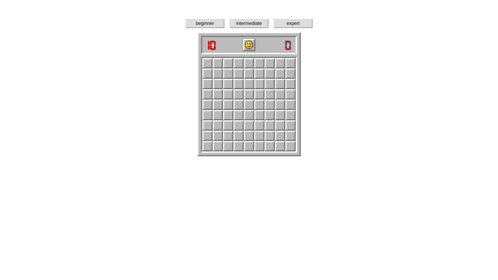
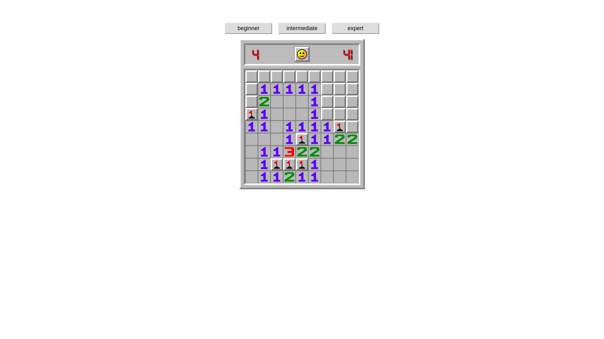
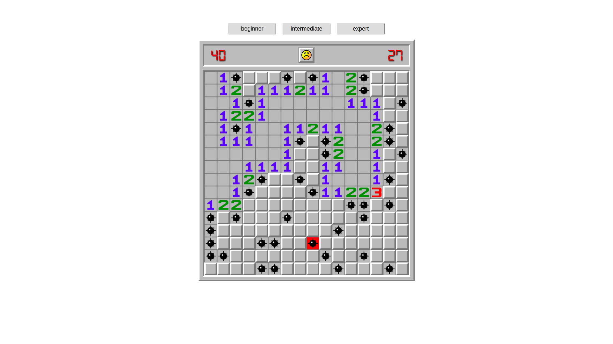
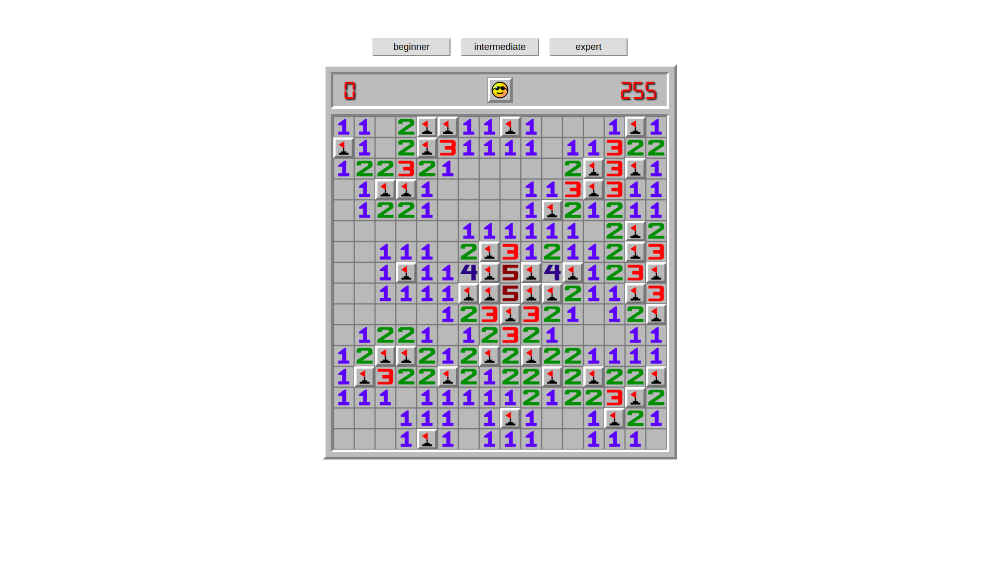

# Minesweeper Javascript Game
### I built this project in about 3 weeks using:
    -Node.js Express server
    -Vanilla Javascript

##### My goal for this project was to recreate the nostalgic feel of the old Windows98 version of the minesweeper, while sharpening my algorithmic skills and I specifically wanted to deploy this project on Heroku to be able to share a playable, fun and addictive game.
##### The main reason why I decided to make a Javascript game was to learn how Object Oriented principles are applied in the case of Javascript, hence while writing this application I tried to adhere to these principles as best I could, given the limitations of the language.

# 
# 
# 
# 
